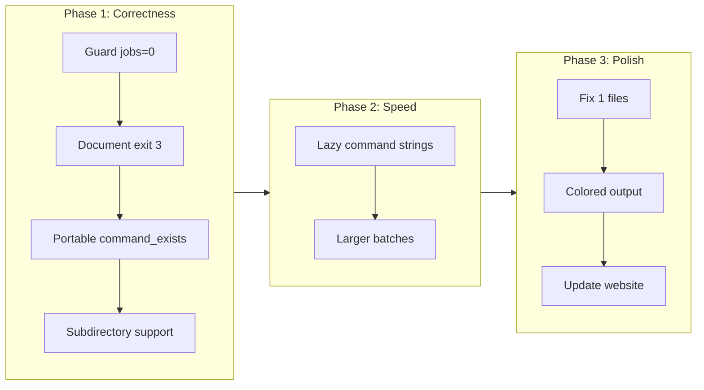

# FFX Priority Fixes Plan

Based on analyzing all three pitches against your goal of "blazing fast, do one thing well", here's a prioritized plan that focuses on **correctness first, then speed, then polish** — avoiding scope creep into features that dilute the core purpose.

## Phase 1: Fix Correctness Bugs

These bugs can break the core "format files" functionality:

### 1.1 Guard against `--jobs 0` panic

The rayon thread pool builder will panic if passed 0. Add clap validation.

```27:28:src/main.rs
    /// Max parallel processes
    #[arg(long, short = 'j', default_value_t = num_cpus())]
```

**Fix:** Add `#[arg(value_parser = clap::value_parser!(usize).range(1..))]`

### 1.2 Document exit code 3 in CLI help

Exit code 3 exists and is tested, but undocumented:

```29:32:src/main.rs
Exit codes:
  0  Success
  1  Formatter failure
  2  Config/general error")]
```

**Fix:** Add `3  Missing executable`

### 1.3 Make `command_exists` portable

Currently uses Unix-only `which`:

```111:117:src/exec.rs
pub fn command_exists(cmd: &str) -> bool {
    Command::new("which")
        .arg(cmd)
```

**Fix:** Use the `which` crate (already handles cross-platform) or check if `Command::new(cmd).arg("--version")` succeeds.

### 1.4 Support running from subdirectories

Git outputs repo-root-relative paths, but formatters are invoked from the current directory. Running `ffx` from a subdirectory will fail because paths like `src/main.rs` won't resolve.

**Fix:** Use the existing `repo_root()` function to:

1. Detect the git root directory
2. Either `cd` to repo root before running formatters, OR
3. Convert paths to absolute paths before passing to tools

This also means we should **keep** `repo_root()` instead of removing it.

## Phase 2: Performance Optimizations ("Blazing Fast")

### 2.1 Only build command strings when verbose

Currently allocates large strings for every batch, even when not printed:

```84:93:src/exec.rs
    let command = format!(
        "{} {} {}",
        tool.cmd,
        tool.args.join(" "),
        files.iter().map(|p| p.to_string_lossy()).collect::<Vec<_>>().join(" ")
    );
```

**Fix:** Pass a `verbose: bool` flag to `run_batch()` and only build the command string when needed. For large file sets (100+ files), this eliminates significant allocation overhead.

### 2.2 Increase batch size

The current `MAX_FILES_PER_BATCH = 50` is conservative. Unix `ARG_MAX` is typically 256KB-2MB. With average path lengths of 50-100 chars, 200-500 files per batch is safe and reduces process spawn overhead.

```12:src/exec.rs
const MAX_FILES_PER_BATCH: usize = 50;
```

**Fix:** Increase to 200, or compute dynamically based on total arg byte length.

## Phase 3: Polish (Do One Thing Well)

### 3.1 Fix "1 files" grammar

```149:src/main.rs
        println!("- {} ({} files): {}", m.tool.name, m.files.len(), file_list);
```

**Fix:** Use conditional `if n == 1 { "file" } else { "files" }`

### 3.2 Add colored output

Make success/failure status more visible with colors:

- `✓` in green for success
- `✗` in red for failure
- Tool names in cyan
- File counts in default color

**Fix:** Add the `colored` crate and use it in the output formatting:

```rust
use colored::Colorize;
println!("{} [{}] {} files", "✓".green(), name.cyan(), file_count);
```

### 3.3 Update website install command

The website shows the harder method first:

```469:docs/index.html
      <div class="install-cmd">cargo install --git https://github.com/briansigafoos/fast-format-x</div>
```

**Fix:** Show curl/install.sh first (matches README), cargo as fallback. Also fix the "∞" parallel stat to be accurate (CPU cores or Nx).

### 3.4 Add security attributes to external links

```471:472:docs/index.html
333        Requires <a href="https://rustup.rs" target="_blank">Rust</a> ·
```

**Fix:** Add `rel="noopener noreferrer"` to all `target="_blank"` links.

## Phase 4: Consider Later (Not Blocking)

These are real issues but not essential for "format files correctly and fast":

| Issue | Why Defer |

|-------|-----------|

| NUL-safe git parsing (`-z` flag) | Only matters for paths with spaces/special chars — edge case |

| `--check` mode | New feature, not a fix |

| `--restage` flag | Pre-commit workflow enhancement, not core |

| Linux binary builds | Distribution concern, not core functionality |

## Summary: What to Do First



This plan delivers maximum impact with minimal scope creep — keeping ffx focused on being the fastest, most reliable way to format files.
